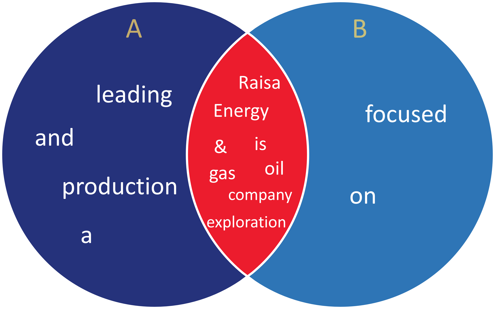

# Fuzzy Text Matching In Snowflake


Reading: 5 mins

In this article, We will tackle the different approaches we could take with finding if two words/sentences are similar or not, and with what percentage depending on the algorithm which we will use.

After reading, you will have the ability to compare between two strings depending on the type of text, you will choose the best approach or a combine of multiple approaches.
<hr>

## **Topics**

1. Understanding Text Similarity
2. Text Similarity Metrics
    1. Jaccard Index
    2. Levenshtein Distance
    3. Jaro-Winkler
3. Use Cases
4. Conclusion
<hr>

## **Understanding Text Similarity**

Similarity: The process to determine if two items are similar(close) or not ... For an example two cars: you have many ways to compare between them by color, shape,brand and all sorts of other perspectives you can look at.


Then, Text Similarity: The process to determine if two strings(text) are similar or not both in meaning(semantic) and the words itself(lexical).

* Semantic similarity: Focusses on the meaning behind the words itself not the characters / words by itself.
* Lexical similarity: Focusses on the words by itself like how many times does the word appear or if it's missing a letter (William -> Williams).

For example: The mouse ate the cheese.

1. The cat ate the mouse. (Similar in wording but different in meaning)
2. The rat consumed the cheese. (Different in wording but Similar in meaning).

In this article, We will focus on the Lexical similarity between two sentences/names.
<hr>

## **Text Similarity Metrics**
There are multiple metrics to find if two strings are similar or not. We will use sql on [Snowflake Data Cloud](https://www.snowflake.com/en/) to tackle most of the commonly used metrics, for it's built-in functions capabilities.

<hr>

## **1. Jaccard Index**
Jaccard Index (also known as Jaccard Similarity coefficient) is used to compare between two sets of words (distinct), It gives a metric from 0% to 100%. The higher the metric the closest the two strings are to each other. 

It's calculated through the division of the intersected words $(A\cap B)$ to the union words $(A\cup B)$:
$$ J(A,B) = { |A\cap B| \over |A\cup B| } $$
**Example:**

A: "Raisa Energy is a leading oil & gas exploration and production company"<br>
B: "Raisa Energy company is focused on oil & gas exploration"


$$ J(A,B) = {|\textcolor{EC1C2D}{A\cap B}| \over |\textcolor{25327B}{A}\textcolor{EC1C2D}{\cup} \textcolor{2E75B6}{B}| } = {\textcolor{EC1C2D}{8} \over \textcolor{25327B}{4}+\textcolor{EC1C2D}{8}+\textcolor{2E75B6}{2}} = 57 \% $$

**Snowflake Example:**
<br>


```sql
CREATE TEMP TABLE JACCARD_INDEX_EXAMPLES (TEXT_A VARCHAR, TEXT_B VARCHAR);
INSERT INTO JACCARD_INDEX_EXAMPLES (TEXT_A,TEXT_B) 
VALUES 
    ('I love dogs and cats','I love cats'),
    ('Coding is great','I Hate Coding'),
    (
        'Raisa Energy is a leading oil & gas exploration and production company', 
        'Raisa Energy company is focused on oil & gas exploration'
    ),
    ('Well Name 10 15 20H','Name Well 10 15 J 20HX'),
    ('Did you sleep well ?', 'Are you well ?')
;
```


```sql 
SELECT 
    TEXT_A,
    TEXT_B,
    -- split by the spaces and take only the distinct words
    ARRAY_DISTINCT(SPLIT(LOWER(TEXT_A),' ')) TEXT_A_TOKENS,
    ARRAY_DISTINCT(SPLIT(LOWER(TEXT_B),' ')) TEXT_B_TOKENS,
    -- the intersection between the two texts
    ARRAY_INTERSECTION(TEXT_A_TOKENS,TEXT_B_TOKENS) TEXT_INTERSECTED_TOKENS,
    -- the union by concatenating the two texts tokens and get the distinct tokens
    ARRAY_DISTINCT(ARRAY_CAT(TEXT_A_TOKENS,TEXT_B_TOKENS)) TEXT_UNION_TOKENS,
    ARRAY_SIZE(TEXT_INTERSECTED_TOKENS) / ARRAY_SIZE(TEXT_UNION_TOKENS) * 100 JACCARD_INDEX
FROM JACCARD_INDEX_EXAMPLES;
```
> [SPLIT](https://docs.snowflake.com/en/sql-reference/functions/split):Splits a given string with a given separator and returns the result in an array of strings.<br>
[LOWER](https://docs.snowflake.com/en/sql-reference/functions/lower): Returns the input string with all characters converted to lowercase.<br>
[ARRAY_DISTINCT](https://docs.snowflake.com/en/sql-reference/functions/array_distinct): Excludes any duplicate elements that are present in the input ARRAY.<br>
[ARRAY_INTERSECTION](https://docs.snowflake.com/en/sql-reference/functions/array_intersection): Returns an array that contains the matching elements in the two input arrays.<br>
[ARRAY_CAT](https://docs.snowflake.com/en/sql-reference/functions/array_cat): Returns a concatenation of two arrays.<br>

| TEXT_A| TEXT_B | ... | JACCARD_INDEX |
|-|-|-|---------------|
| I love dogs and cats| I love cats|...| 60|
| Coding is great| I Hate Coding|...| 20|
| Raisa Energy is a leading oil & gas exploration and production company | Raisa Energy company is focused on oil & gas exploration |...| 57.1429|
| Well Name 10 15 20HX| Name Well 10 15 J 20HX|...| 83.3333|
| Did you sleep well ?| Are you well ?|...| 50|


> **Note:**<br> keep in mind that the Jaccard similarity is a basic measure of similarity that simply considers words present or absent in the texts into account. The frequency or order of the words are not taken into consideration. You might look at more complex similarity measurements depending on your particular use case.
<hr>

## **2. Levenshtein Distance**
Levenshtein Distance (aka Edit Distance) is used to compare between two texts, It gives a score from 0 to infintie $(\infty)$. The lower the score the closest the two texts are to each other.

It counts the minimum number of single character changes (insertions, deletions or substitutions) to convert the source text to the target text


**Example**: 
1. raesa → raisa (substitution of 'e' for 'i')
2. raisas → raisa (deletion of 's' at the end)
3. aisa → raisa (insertion of 'r' at the beginning)
    <br>

All of those examples have a distance of 1.


>  [Levenshtein Distance Calculator](https://planetcalc.com/1721/) is really good if you want a better understanding inputting your own examples.

**Snowflake Example:**
<br>


```sql
CREATE TEMP TABLE LEVENSHTEIN_DISTANCE_EXAMPLES (TEXT_A VARCHAR, TEXT_B VARCHAR);
INSERT INTO LEVENSHTEIN_DISTANCE_EXAMPLES (TEXT_A,TEXT_B) 
VALUES 
    ('william','williams'),
    ('ntiresys','interest'),
    ('carray','bark'),
    ('North','South'),
    ('Energy', 'Inrgy')
;
```


```sql 
SELECT 
    TEXT_A,
    TEXT_B,
    -- Get the L. distance between the two texts by snowflake built-in function
    EDITDISTANCE(TEXT_A,TEXT_B) L_DISTANCE
FROM LEVENSHTEIN_DISTANCE_EXAMPLES;
```
> [EDITDISTANCE](https://docs.snowflake.com/en/sql-reference/functions/editdistance): Computes the Levenshtein distance between two input strings. It is the number of single-character insertions, deletions, or substitutions needed to convert one string to another.<br>


| TEXT_A| TEXT_B |   L_DISTANCE |
|-|-|---------------|
|william	|williams	|1
|ntiresys|	interest|	4
|carray|	bark	|4
|North|	South|2
|Energy|	Inrgy	|2


> **Note:**<br> 
Unlike some other metrics (e.g. Damerau-Levenshtein distance), character transpositions are not considered.
<hr>

## **3. Jaro-Winkler**
Jaro-Winkler Similarity is used to compare between two texts, It gives a score from 0% to 100%. The higher the score the closest the two texts are to each other.

It's Like Levenshtein Distance but it's taking into consideration the number of transpositions between characters.

> **Note:**<br> 
There is a metric 'Jaro' which 'Jaro-Winkler' is based upon.<br>
The difference is that 'Jaro-Winkler' takes into account the common substring prefix between the two texts.

$$
Jaro~Similarity =
sim_j = \begin{cases}
0 & \text{if } m = 0 \\
{1 \over 3}({m \over |s_1|}+{m \over |s_2|}+{m-t \over m}) & \text{otherwise} 
\end{cases}
$$

$$
JaroWinkler =
sim_w = sim_j + l * p * (1-sim_j)
$$

* $s_i$: Length of word.
* $m$: Number of matching characters.
* $t$: Number of  transpositions.
* $l$: length of common prefix at the start of the string up to max of 4.
* $p$: Constant [Scaling Factor](https://en.wikipedia.org/wiki/Scaling_(geometry)#Uniform_scaling) should not exceed .25(if $l$ is max at 4), Standard Value = 0.1.

**Example**:
<br>
Src Word: 'risaa', Target Word: 'raisa'


$$
sim_j ={1 \over 3}({5 \over 5}+{5 \over 5}+{5-2 \over 5})= 86.67 \%
$$
$$
sim_w = .8667 + 1 * 0.1 * (1-.8667)= 88\%
$$


**Snowflake Example:**
<br>


```sql
CREATE TEMP TABLE JARO_W_EXAMPLES (TEXT_A VARCHAR, TEXT_B VARCHAR);
INSERT INTO JARO_W_EXAMPLES (TEXT_A,TEXT_B) 
VALUES 
    ('william','williams'),
    ('risaa','raisa'),
    ('carray','bark'),
    ('North Pole','North'),
    ('Energy', 'Inrgy')
;
```


```sql 
SELECT 
    TEXT_A,
    TEXT_B,
    -- Get the jaro-winkler score between the two texts by snowflake built-in function
    JAROWINKLER_SIMILARITY (TEXT_A,TEXT_B) JARO_W_SCORE
FROM JARO_W_EXAMPLES;
```
> [JAROWINKLER_SIMILARITY](https://docs.snowflake.com/en/sql-reference/functions/jarowinkler_similarity): Computes the Jaro-Winkler similarity between two input strings. The function returns an integer between 0 and 100, where 0 indicates no similarity and 100 indicates an exact match.<br>


| TEXT_A| TEXT_B |   JARO_W_SCORE |
|-|-|---------------|
|william	|williams	|97
|risaa|	raisa|	88
|carray|	bark	|61
|North Pole|	North|90
|Energy|	Inrgy	|82


> **Note:**
>* The similarity computation is case-insensitive.
>* For short strings, Runtime Complexity is $O(|S1|*|S2|)$.
>* For long strings, Runtime Complexity is $O(MAX(|S1|,|S2|))$.
<hr>

## **Use Cases**
1. **Information Retrieval:** Enables us to get the most closet data and build like a search engine to the input query. Actually, we have used it in the matching of well names to their API(id) from the data sent to make up for the human errors every here and there.
   
2. **Plagiarism/Fraud Detection:** can be used to compare a given document with a vast database of existing texts, highlighting potential similarities and indicating possible cases of plagiarism.
   
3. **Customer Support:** Assist in customer support applications by automatically matching customer queries, Which we are looking forward to create a sql query generator to access the data from the database that would be very useful for non technical people.

4. **Machine Understanding:** Currently, There is a trend towards AI and Chatgpt which is based on NLP and Semantic Similarly, allowing for various engagements with the machine: Translation, Auto-Correct, Speech/Voice Recognition, Chat-Bot and Way More !
<hr>

## **Conclusion**
In conclusion, exploring text similarity in Snowflake can unlock a range of possibilities. By utilizing powerful algorithms and leveraging Snowflake's user-friendly environment, you can easily implement text similarity analysis without the need for extensive programming. Snowflake's streamlined approach empowers users to uncover insights, make data-driven decisions, and extract valuable information from textual data efficiently. Whether it's for recommendation systems, clustering, or other applications, Snowflake provides a simplified yet robust solution for text similarity tasks, enabling users to harness the power of text analysis with ease.

We might not covered everything in detail—probably more than what we actually discussed. However, our goal was to introduce you to the practical examples of text similarity in Snowflake. These algorithms are powerful and usually involve complex programming in any language, even with available libraries. But Snowflake makes their implementation incredibly straightforward.
<hr>

## **Want to Know More?**
Check out these links:
* [Comparing string similarity algorithms for different apps](https://medium.com/@appaloosastore/string-similarity-algorithms-compared-3f7b4d12f0ff)
* [Online string similarity comparison app, using various metrics](https://asecuritysite.com/forensics/simstring)
* [Introduction to semantic similarity using NLP and Python](https://medium.com/@tanner.overcash/semantic-similarity-calculations-using-nlp-and-python-a-soft-introduction-1f31df965e40)